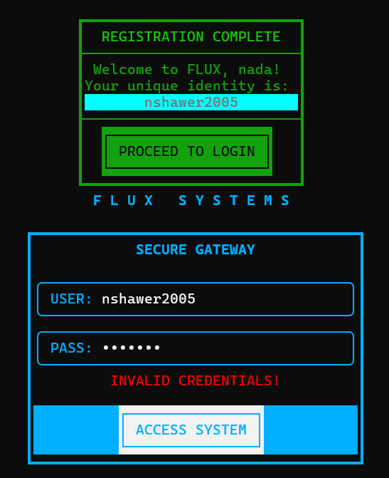
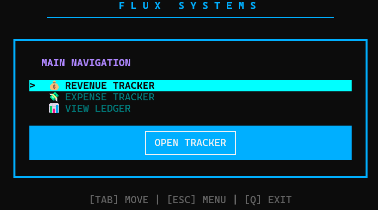
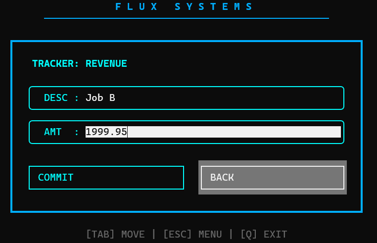
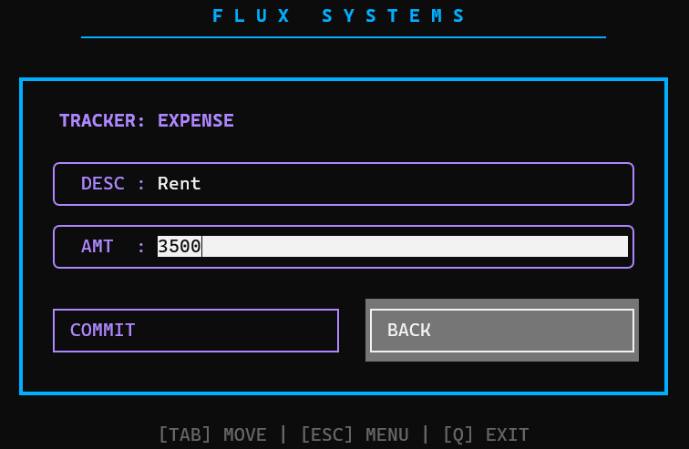
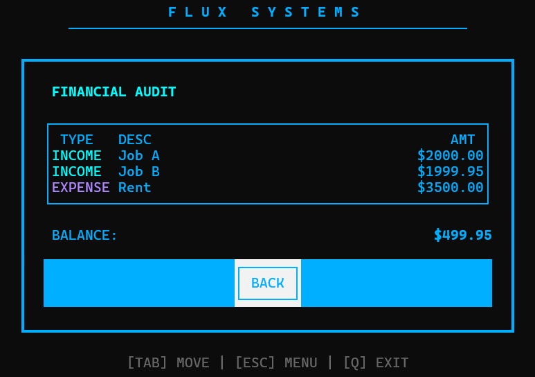

# ⚙️ Flux: Financial Budget Tracker

<p align="left">
  
  
  
</p>

**Flux** is a high-performance financial tracking engine powered by **C++20**. Designed with a "Systems-First" philosophy, it treats personal finance with the precision of a low-level engine. By utilizing a **Unified Frame Architecture**, Flux provides a seamless, single-page GUI experience directly inside the terminal, delivering extreme memory efficiency without the bloat of traditional frameworks.

---

## ✨ My Inspiration

Flux isn't just a project to me, it’s actually my very first 'Deep Dive' into the world of programming! I built this as my first complete C++ project because I was tired of just scratching the surface. I wanted to dive deep, break things, and understand what’s actually happening under the hood of a computer.

This project became the foundation of everything I know today. It’s what inspired me to keep exploring, keep building, and eventually dive head-first into the world of Systems and Software Engineering. It’s definitely come a long way from my early experiments, and looking at this code always reminds me of how much I’ve leveled up since I first started typing `int main()`. It’s messy in the memories, but clean in the code!

---

## 🖼️ Example Menu Screenshots

Registration Menu: 
If password/usernae doesn't match: 
After entering valid crednetials yous houdl see the main tracker page: 
Income tracker menu: 
Expense tracker menu: 
budget/report menu: 

## 🚀 Quick Start

**Clone the repository:**

```bash
git clone [https://github.com/nadasshawer/flux-budget-tracker.git](https://github.com/nadasshawer/flux-budget-tracker.git)
cd flux-budget-tracker
```

**Build the Engine:**

```bash
mkdir build && cd build
cmake ..
make
```

**Launch the TUI:**

```bash
./flux_engine
```

---

## 📁 Project Structure

```txt
├── include/                 # Blueprints: All Header Files (.h)
│   ├── auth/                # registration.h, user_info.h
│   ├── core/                # menu_handler.h, navigation logic
│   ├── models/              # report.h (Transaction history)
│   └── validation/          # input validation & regex
│
├── src/                     # The Engine: Core C++ Logic (.cpp)
│   ├── auth/                # Secure login & registration logic
│   ├── core/                # Unified Frame TUI & State Management
│   ├── models/              # Accounting logic & data structures
│   └── validation/          # Strict year & password checks
│
├── CMakeLists.txt           # Modern build configuration
└── README.md                # You're here!
```

---

## 🛠️ Key Features

### 1. Unified Frame Interface

Unlike standard terminal apps, Flux uses a **Single-Page Application (SPA)** approach. The main system border stays static while the internal content (Income, Expense, Ledger) swaps out dynamically, creating a true GUI feel.

### 2. Precise Financial Ledger

- **Real-Time Auditing:** Automatically calculates Net Position using high-precision doubles.
- **Formatted Reporting:** Generates a structured accounting table with column alignment and 2-decimal point enforcement.

### 3. Secure Gateway

- **Strict Validation:** Validates birth years (1900-2026) and enforces password complexity.
- **Identity Matching:** Cross-references session credentials to prevent unauthorized access.

### 4. Interactive UX

- **Mouse Support:** Full mouse integration for menu selection and button clicks.
- **Global Hotkeys:** Quick emergency exit and navigation via keyboard interrupts (`Q` / `ESC`).

---

## 📈 Roadmap

- [x] **Milestone 1:** Core Inheritance & Memory Management
- [x] **Milestone 2:** Refactoring for "Headless" Logic
- [x] **Milestone 3:** Unified Frame FTXUI Implementation

---

## 💡 Pro-Tip

For the smoothest mouse experience and best color rendering, run Flux in **Windows Terminal** or **VS Code's Integrated Terminal**.
